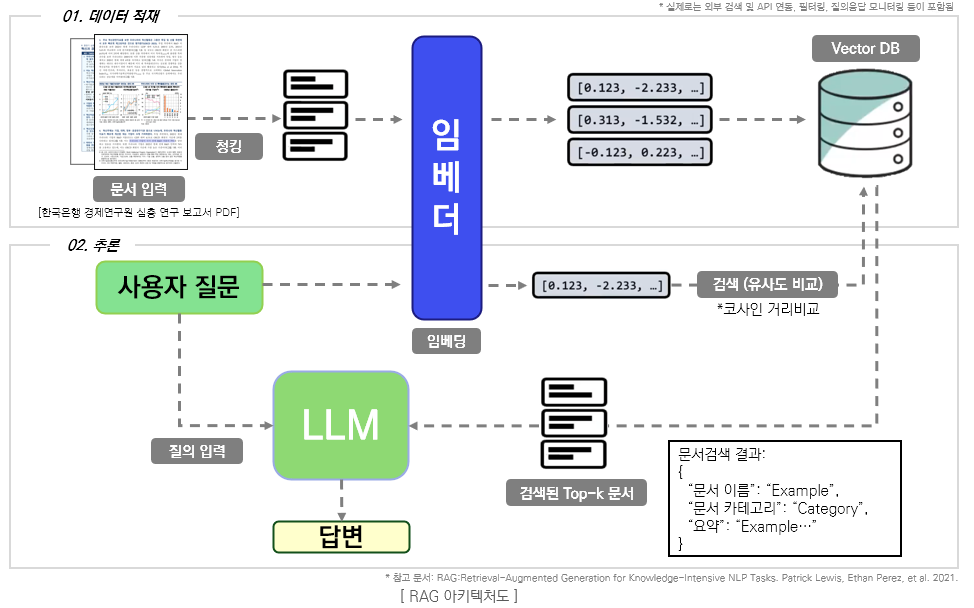
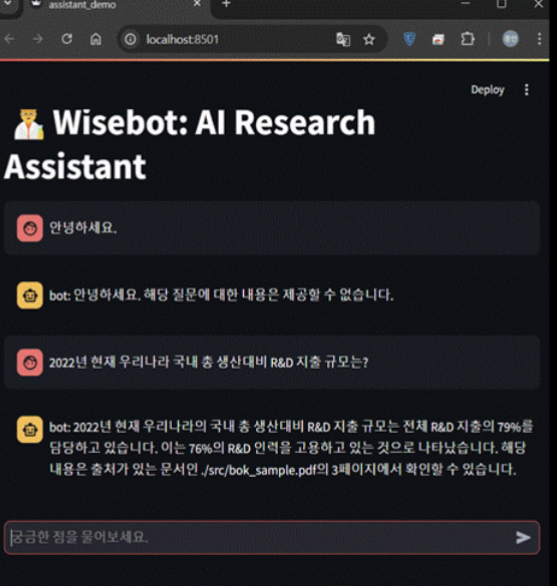
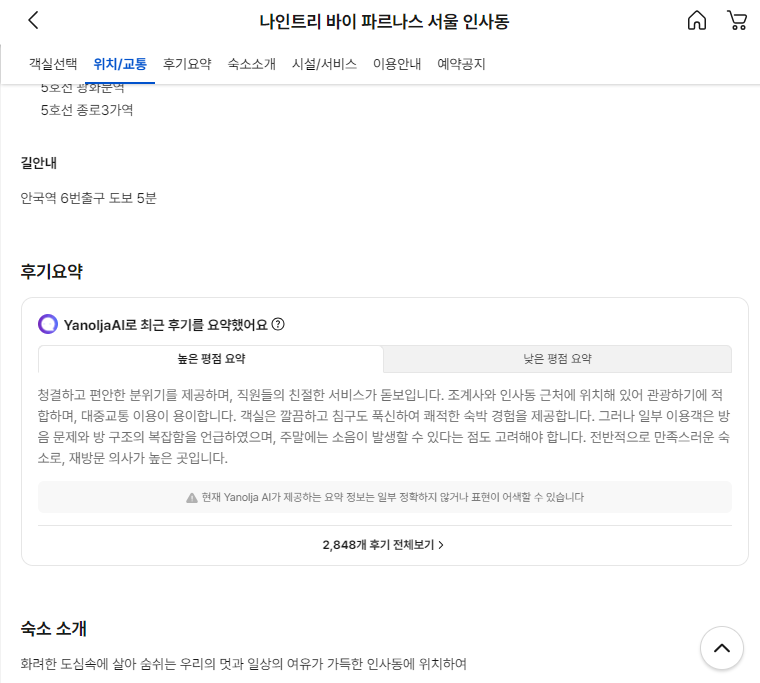
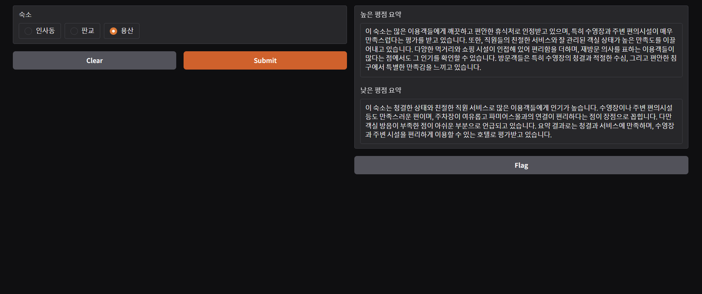

# AI & DeepLearnig 연구를 위한 리포지터리

## Part 0. LLM & RAG TEST
RAG 기술을 기반으로 로컬에서도 운영가능한 개인화된 챗봇을 구현한다.

### 사용 기술
- Python 3.12
- gpt 3.5-turbo-0125, Llama-3.2-3b, 42dot_LLM-SFT-1.3b
- LangChain, RAG
- FAISS DB
- Streamlit

### 구현 기능
- Vector DB 매니저
- 문서 DB 등록 및 검색
- LLM 기반 추론
- 모델테스트(BLEU, ROUGE, 응답속도) 자동화
- 데모 클라이언트

### 서비스 아키텍처

### 모델 테스트 결과
|구분|OpenAI|META|42dot|
|:---:|:---:|:---:|:---:|
|모델 명칭|gpt 3.5-turbo-0125|Llama-3.2-3b|42dot_LLM-SFT-1.3b|
|BLEU|0.379|0.122|0.139|
|ROUGE|rouge1: 0.500 rouge2: 0.285 rougeL: 0.500|rouge1: 0.333 rouge2: 0.181 rougeL: 0.333|rouge1: 0.526 rouge2: 0.117 rougeL: 0.421|
|평균 응답 속도|1.62|2111.22 (약 35분)|725.48 (약 12분)|
|평가환경|클라우드|로컬|로컬|

### 실행화면

## Part 1. 파이썬 기초
## Part 4. 야놀자 리뷰 요약 봇
### 실제 서비스 화면(예시)

야놀자에서 실제 서비스 중인 리뷰 요약 서비스를 
OpenAI의 API를 이용하여 직접 만들어 보고 평가를 진행한다.

### 사용 기술
- Python 3.12
- OpenAI(gpt 3.5-turbo, gpt-4)
- beautiful soap 4, selenium (for review crawling)

### 평가 도구
- MT-Bench

### 실행 화면

## Part 5. 카카오톡 대화 요약 봇
## Part 6. 네이버 영화 리뷰 분석 봇
## Part 8. RAG 아키텍처
## Part 9. AI-FAQ 생성 봇
## Part 10. 뉴스 정리 봇
## Part 12. 사내 업무 에이전트
## Part 13. 투자 어시스턴트 with sLM & RAG
## Part 14. 배민 리뷰 기반 메뉴/맛집 추천
### 기술 스택
- OpenAI ChatGPT
- Prompt Engineering, LLM Evaluation
- BeautifulSoup4, Selenium
- NumPy, Pandas
- Gradio, Slackbot, Google Calendar API
- Huggingface Hub
- MongoDB, FastAPI