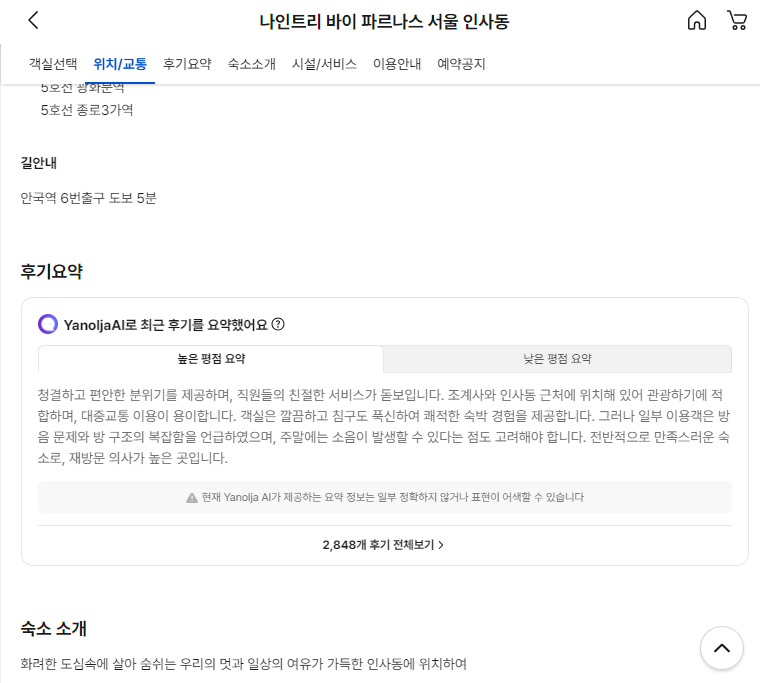
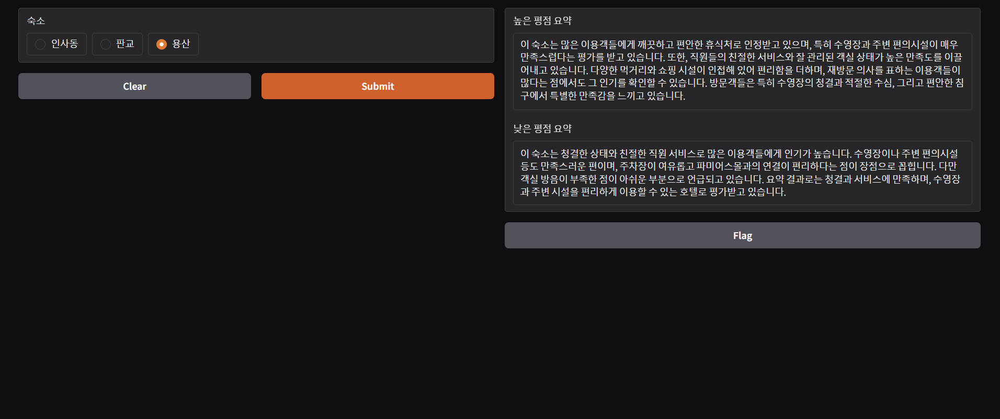

# 야놀자 리뷰 요약하기

### 실제 서비스 화면

야놀자에서 실제 서비스 중인 리뷰 요약 서비스를 
OpenAI의 API를 이용하여 직접 만들어 보고 평가를 진행한다.

### 사용 기술
- Python 3.12
- OpenAI(gpt 3.5-turbo, gpt-4)
- beautiful soap 4, selenium (for review crawling)

### 평가 도구
- MT-Bench

### 실행 화면
